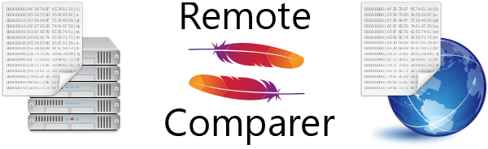

# remote-comparer-maven-plugin



A [Maven](https://maven.apache.org) plugin to compare a local file with a remote file. This is useful if your project for instance has a local copy of a schema definition, configuration or any other type of data that should ideally be kept up to date with a remote file.

If the local and remote files are equal, the plugin returns fine; if not, a warning is printed that the files differ. Optionally, the plugin can be configured to give an error so that the build will not continue.

## Usage

### Parameters
* `localFilePath` _required_: Path to a local file to be compared.
* `remoteFileUri` _required_: Uri to a remote file to be compared.
* `timeoutMs` _optional_: Timeout in milliseconds for fetching the remote file. A timeout of 0 is interpreted as infinite timeout. Default: `10000`
* `failOnFileDifference` _optional_: If set to true, the build will fail if the files differ (or if errors arise when checking if they are different). If set to false (default), the build will NOT fail but simply produce a warning. Default: `false`
* `failOnFilesNotFound` _optional_: If set to true, the build will fail if the local file can't be found or the remote file can't be downloaded. If set to false (default), the build will NOT fail but simply produce a warning. Default: `false`
* `smallWarningMessage` _optional_: By default, the warning message given if the local and remote files differ is large. Set this to true to instead print warning message that only contain the necessary information.. Default: `false`

### Maven
Example of how to compare two local files with remote counterparts.
Include in your pom.xml file:

```xml
<project>
  <!-- ... groupId, artifactId, definitions and dependencies ... -->

  <build>
    <plugins>
      <plugin>
        <groupId>com.github.sjoblomj</groupId>
        <artifactId>remote-comparer-maven-plugin</artifactId>
        <version>1.0.3</version>
        <executions>
          <execution>
            <id>compare schema-definition</id>
            <goals>
              <goal>remote-compare</goal>
            </goals>
            <configuration>
              <localFilePath>src/main/resources/schema-definition.json</localFilePath>
              <remoteFileUri>https://example.com/remote/schema/definition</remoteFileUri>
              <timeoutMs>20000</timeoutMs>
              <failOnFileDifference>true</failOnFileDifference>
              <failOnFilesNotFound>true</failOnFilesNotFound>
            </configuration>
          </execution>
          <execution>
            <id>compare properties</id>
            <goals>
              <goal>remote-compare</goal>
            </goals>
            <configuration>
              <localFilePath>src/main/resources/application.properties</localFilePath>
              <remoteFileUri>https://example.com/remote/application.properties</remoteFileUri>
              <smallWarningMessage>true</smallWarningMessage>
            </configuration>
          </execution>
        </executions>
      </plugin>
    </plugins>
  </build>

  <pluginRepositories>
    <pluginRepository>
      <id>jitpack.io</id>
      <url>https://jitpack.io</url>
    </pluginRepository>
  </pluginRepositories>
</project>
```

### Command-line
The plugin can be run directly from the terminal in a directory with a maven project:

`$ mvn remote-comparer:remote-compare -DremoteFileUri=https://example.com/remote/file -DlocalFilePath=src/main/resources/schema-definition.json -DfailOnFileDifference=true`

### Technical
A few technical notes for the interested:
* The remote files will be downloaded to the target directory. After comparison, they is deleted.
* When comparing files, the end of lines are not considered.
* Maven Modules are supported: If the remote-comparer-maven-plugin is in a submodule, then give the `localFilePath` relative to the submodule. The base directory of the submodule will be used as the path in which to look for `localFilePath`.
* The plugin runs during the `VALIDATE` phase of Maven.


## License
This code is dual-licensed under [Apache License 2.0 or later](LICENSE), or the [MIT License](LICENSE-MIT)

## Icon
The icon for this project represents a file on a local drive on the left, and a remote file from the Internet on the right. The Apache Maven feathers form an equality sign between them.

This plugin is in no way part of or affiliated to the Apache Software Foundation or its projects. The usage of the Apache Feathers in the logo is because this is a Maven plugin; it is not meant to suggest that this project is an "official" Apache product.

* The [Apache Feather Logo](https://commons.wikimedia.org/wiki/File:Apache_Feather_Logo.svg), trademark owned by the [The Apache Software Foundation](https://www.apache.org/), Apache License v2.0
* The [Network Server icon](https://commons.wikimedia.org/wiki/File:Oxygen480-places-network-server.svg), by the [KDE Oxygen Team](https://github.com/KDE/oxygen-icons5/blob/master/AUTHORS), LGPL 3
* The [hex file icon](https://commons.wikimedia.org/wiki/File:Oxygen15.04.1-text-x-hex.svg), by the [KDE Oxygen Team](https://github.com/KDE/oxygen-icons5/blob/master/AUTHORS), LGPL 3
* The [Internet icon](https://commons.wikimedia.org/wiki/File:Oxygen480-categories-applications-internet.svg), by the [KDE Oxygen Team](https://github.com/KDE/oxygen-icons5/blob/master/AUTHORS), LGPL 3
